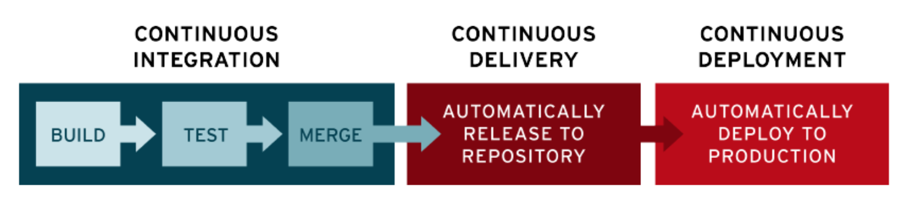

# DevOps

## What’s a CI/CD pipeline?

A continuous integration and continuous deployment (CI/CD) pipeline is a series of steps that must be performed in order to deliver a new version of software

A pipeline is a process that drives software development through a path of building, testing, and deploying code.
By automating the process, the objective is to minimize human error and maintain a consistent process for how software is released.
Tools that are included in the pipeline could include: compiling code, unit tests, code analysis, security, and binaries creation. For containerized environments, this pipeline would also include packaging the code into a container image to be deployed across a hybrid cloud.

## Deployment Best Practices

https://learn.microsoft.com/en-us/azure/app-service/deploy-best-practices#use-deployment-slots

Production slot, which is not recommended for setting up CI/CD.Learn more

## Configure a user-assigned managed identity to trust an external identity provider

https://learn.microsoft.com/en-us/entra/workload-id/workload-identity-federation-create-trust-user-assigned-managed-identity?pivots=identity-wif-mi-methods-azp

### Managed Identity in Azure
User-Assigned Managed Identity: This is a type of managed identity in Azure that you create and assign to one or more Azure resources.

### External Identity Provider (IdP)
GitHub: In this context, GitHub acts as the external identity provider. GitHub provides the identity tokens that can be used to authenticate to Azure resources.

### Federated Identity Credential
A federated identity credential allows Azure to trust tokens issued by an external identity provider. This is useful for scenarios where applications or services running outside of Azure need to authenticate and access Azure resources securely without managing secrets or credentials.

### Example Scenario: GitHub Actions to Azure
GitHub Actions: workflow running in GitHub Actions.
Federated Identity Credential: federated identity credential in Azure that trusts tokens issued by GitHub.
Managed Identity: user managed identity assigned to the Azure resource that the GitHub Actions workflow needs to access.

### Summary
Managed Identity: Resides in Azure.
Identity Provider: GitHub, issuing tokens for GitHub Actions workflows.
Federated Identity Credential: Configured in Azure to trust tokens from GitHub, allowing secure, token-based access to Azure resources.

This setup facilitates secure and seamless integration between GitHub and Azure, enabling automated workflows (like CI/CD pipelines) to interact with Azure resources without handling traditional secrets.